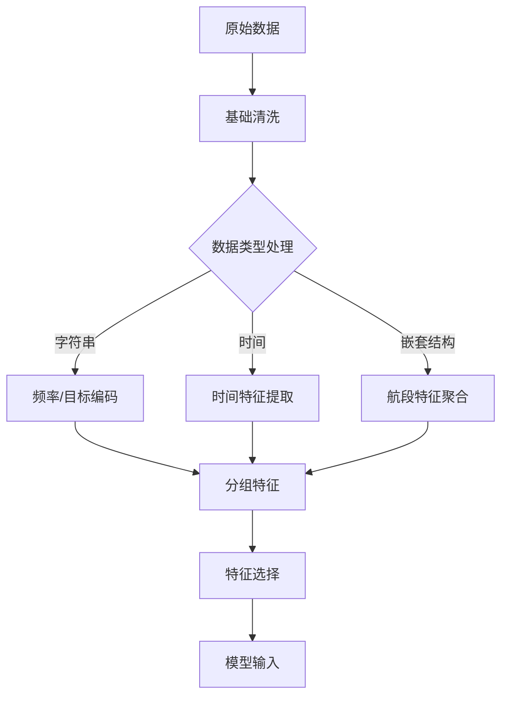
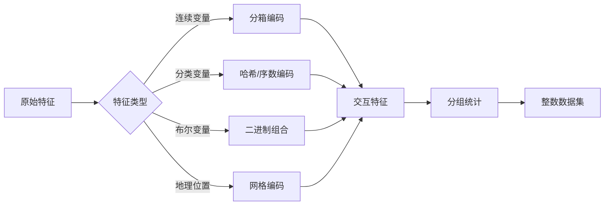

针对您提供的航班数据集，我将详细说明特征工程的解决方案，特别关注特殊数据类型（如字符串、时间、嵌套结构）的处理策略。以下是系统的处理方案：

### 1. 字符串类型特征处理

**高基数类别特征（机场、航空公司等）：**

```python
# 频率编码示例
airport_freq = df['legs0_segments0_departureFrom_airport_iata'].value_counts(normalize=True)
df['departure_airport_freq'] = df['legs0_segments0_departureFrom_airport_iata'].map(airport_freq)

# 目标编码（使用平滑）
mean_target = df['selected'].mean()
smoothing = 100
airport_target = df.groupby('legs0_segments0_departureFrom_airport_iata')['selected'].agg(['count', 'mean'])
airport_target['smooth'] = (airport_target['count'] * airport_target['mean'] + smoothing * mean_target) / (airport_target['count'] + smoothing)
df['departure_airport_target'] = df['legs0_segments0_departureFrom_airport_iata'].map(airport_target['smooth'])
```

**低基数类别特征（舱位等级、VIP等）：**

```python
# One-Hot编码
df = pd.get_dummies(df, columns=['isVip', 'isAccess3D', 'legs0_segments0_cabinClass'], prefix_sep='_')
```

### 2. 时间特征处理

**日期时间解析：**

```python
# 转换时间格式
time_cols = ['legs0_departureAt', 'legs0_arrivalAt', 'requestDate']
for col in time_cols:
    df[col] = pd.to_datetime(df[col])
  
# 提取关键时间特征
df['departure_hour'] = df['legs0_departureAt'].dt.hour
df['departure_dayofweek'] = df['legs0_departureAt'].dt.dayofweek
df['advance_booking_days'] = (df['legs0_departureAt'] - df['requestDate']).dt.days
```

**飞行时长处理：**

```python
# 转换时长到分钟
def duration_to_minutes(duration_str):
    if pd.isna(duration_str):
        return np.nan
    h, m, s = map(int, duration_str.split(':'))
    return h*60 + m

df['legs0_duration_min'] = df['legs0_duration'].apply(duration_to_minutes)
```

### 3. 嵌套航段特征处理

**航段特征聚合：**

```python
# 行李额度特征
baggage_cols = [c for c in df.columns if 'baggageAllowance_quantity' in c]
df['min_baggage'] = df[baggage_cols].min(axis=1)
df['max_baggage'] = df[baggage_cols].max(axis=1)

# 航段连接性特征
df['total_segments'] = 0
for i in range(4):  # 假设最多4个航段
    seg_col = f'legs0_segments{i}_flightNumber'
    df['total_segments'] += (~df[seg_col].isna()).astype(int)

# 航空公司多样性
carrier_cols = [c for c in df.columns if 'marketingCarrier_code' in c]
df['unique_carriers'] = df[carrier_cols].nunique(axis=1)
```

### 4. 分组特征（ranker_id级别）

```python
# 组内价格排名
df['price_rank_in_group'] = df.groupby('ranker_id')['totalPrice'].rank(ascending=True)

# 组内时间优势
df['duration_rank_in_group'] = df.groupby('ranker_id')['legs0_duration_min'].rank(ascending=True)

# 组内相对价格
group_stats = df.groupby('ranker_id')['totalPrice'].agg(['mean', 'std']).reset_index()
group_stats.columns = ['ranker_id', 'group_price_mean', 'group_price_std']
df = df.merge(group_stats, on='ranker_id')
df['price_deviation'] = (df['totalPrice'] - df['group_price_mean']) / df['group_price_std']
```

### 5. 特征选择策略

```python
# 删除高冗余特征
drop_cols = [
    'legs0_segments0_aircraft_code', 
    'legs0_segments0_arrivalTo_airport_city_iata',
    'legs0_segments1_arrivalTo_airport_city_iata',
    # 添加其他高基数低信息量特征...
]
df = df.drop(columns=drop_cols)

# 保留关键元数据
keep_cols = ['Id', 'ranker_id', 'selected', 'requestDate', 'searchRoute']
```

### 6. 缺失值处理

```python
# 航段特定特征
segment_cols = [c for c in df.columns if 'segments' in c]
df[segment_cols] = df[segment_cols].fillna(-1)

# 数值特征
num_cols = ['totalPrice', 'taxes', 'miniRules0_monetaryAmount']
df[num_cols] = df[num_cols].fillna(df[num_cols].median())

# 类别特征
cat_cols = ['frequentFlyer', 'nationality']
df[cat_cols] = df[cat_cols].fillna('Unknown')
```

### 特征工程架构



### 关键建议：

1. **层次编码**：对机场/航空公司编码时，考虑地理层级（国家-区域-机场）
2. **时间窗口特征**：创建 "早8点前航班"、"周末航班" 等布尔特征
3. **价格敏感度**：结合公司ID和tariffCode创建价格敏感度分组
4. **转机特征**：计算最小转机时间和转机机场规模
5. **常旅客匹配**：创建 "常旅客计划与航空公司匹配" 特征

### 注意事项：

- 使用 `category_encoders`库进行更高级的编码（如LeaveOneOut编码）
- 分组特征计算时需严格防止数据泄露（按ranker_id分组）
- 对高基数特征（如companyID）考虑聚类分组
- 航段特征优先考虑最小值（如最小行李额）而非平均值

以上方案平衡了特征表达力和计算效率，特别关注了竞赛需求的分组排名特性。实际应用中建议使用FeatureTools进行自动化特征生成，并结合SHAP值进行特征重要性分析。


针对需要全部转换为整数格式且保留特征相关性的需求，我推荐以下编码策略，这些方法能有效保持特征间的统计关系：

### 保留相关性的整数编码策略

#### 1. **分箱编码（Bucketing）**

将连续变量分箱后赋予整数值，保留数据分布特性：

```python
# 价格分箱（示例）
bins = [0, 5000, 15000, 30000, 50000, 100000, float('inf')]
labels = [0, 1, 2, 3, 4, 5]
df['price_bin'] = pd.cut(df['totalPrice'], bins=bins, labels=labels).astype(int)

# 飞行时长分箱（分钟）
df['duration_min'] = df['legs0_duration'].apply(lambda x: int(x.split(':')[0])*60 + int(x.split(':')[1]))
bins = [0, 60, 120, 180, 240, 360, 480, float('inf')]
df['duration_bin'] = pd.cut(df['duration_min'], bins=7, labels=False).astype(int)
```

#### 2. **哈希编码（Hashing）**

处理高基数分类特征（如机场代码），保持相似性：

```python
# 机场哈希编码（固定维度）
df['departure_hash'] = df['legs0_segments0_departureFrom_airport_iata'].apply(
    lambda x: int(hashlib.sha256(x.encode()).hexdigest()[:8], 16) % 1024
)
```

#### 3. **序数编码（Ordinal Encoding）**

有序分类变量按逻辑顺序编码：

```python
# 舱位等级编码
cabin_order = {'经济舱': 0, '高端经济舱': 1, '商务舱': 2, '头等舱': 3}
df['cabin_class_ordinal'] = df['legs0_segments0_cabinClass'].map(cabin_order).fillna(-1).astype(int)

# 公司规模编码（假设公司ID隐含规模信息）
df['company_size'] = (df['companyID'] % 10).astype(int)  # 取末位数字代表规模
```

#### 4. **交互特征编码**

创建交叉特征保留变量间关系：

```python
# 时间与价格交互
df['departure_hour'] = pd.to_datetime(df['legs0_departureAt']).dt.hour
df['time_price_int'] = (df['departure_hour'] * df['price_bin']).astype(int)

# 航空公司与舱位交互
df['airline_cabin'] = (df['legs0_segments0_marketingCarrier_code'].astype('category').cat.codes * 10 + 
                       df['cabin_class_ordinal']).astype(int)
```

#### 5. **分组统计编码**

保持组内相关性的整数编码：

```python
# 组内价格排名
df['group_price_rank'] = df.groupby('ranker_id')['totalPrice'].rank(method='dense').astype(int)

# 组内时间分位数
df['group_duration_quantile'] = df.groupby('ranker_id')['duration_min'].transform(
    lambda x: pd.qcut(x, 4, labels=[0,1,2,3], duplicates='drop')
).astype(int)
```

#### 6. **二进制组合编码**

将多个布尔特征压缩为单个整数：

```python
# VIP/3D访问/常旅客组合编码
df['privilege_code'] = (df['isVip'].astype(int) * 4 +
                        df['isAccess3D'].astype(int) * 2 +
                        df['frequentFlyer'].notnull().astype(int))
```

#### 7. **地理坐标编码**

将地理位置转换为网格整数：

```python
# 假设有机场经纬度数据
airport_coords = {'KJA': (56.18, 92.48), 'SVO': (55.97, 37.41)} 

def geo_hash(lat, lon, precision=10000):
    return int((lat * 100 + lon) * precision)

df['departure_geo'] = df['legs0_segments0_departureFrom_airport_iata'].map(
    lambda x: geo_hash(*airport_coords.get(x, (0,0)))
)
```

### 编码实施框架



### 关键注意事项

1. **相关性保护**：

   - 使用分箱而非线性缩放保持分布形态
   - 交互特征保留变量间关系
   - 分组统计维持组内相对关系
2. **高维处理**：

   ```python
   # 使用特征哈希控制维度
   from sklearn.feature_extraction import FeatureHasher
   hasher = FeatureHasher(n_features=256, input_type='string')
   airline_hashed = hasher.transform(df['legs0_segments0_marketingCarrier_code'].fillna('NA'))
   ```
3. **解码保留**：

   ```python
   # 保存编码映射用于推理
   bin_edges = {
       'price': bins,
       'duration': bins
   }
   label_mapping = {
       'cabin': cabin_order,
       'privilege': {0:'普通', 1:'常旅客', 2:'3D访问', 3:'VIP+常旅客', ...}
   }
   ```
4. **特殊值处理**：

   ```python
   # 使用负值表示特殊状态
   df['cabin_class_ordinal'] = df['cabin_class_ordinal'].replace(-1, -999)
   ```

### 优势分析

此策略：

1. 保持特征间统计关系（分箱、交互特征）
2. 处理高基数分类（哈希编码）
3. 压缩维度（二进制组合）
4. 保留空间关系（地理编码）
5. 维持组内结构（分组统计）
6. 全部特征转换为整数格式

最终每个特征都是整数类型，同时通过分箱、交互特征和分组统计保留了原始变量间的相关性，适合后续的树模型或神经网络处理。
