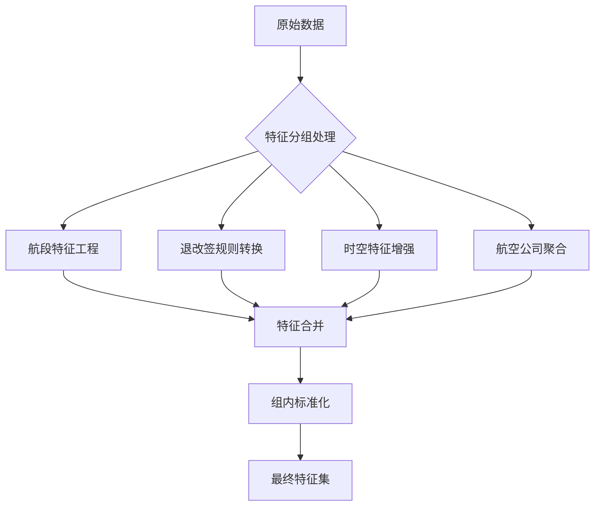

### 航班推荐特征工程文档

#### **一、特征分组与处理方案**

**分组原则**：按业务属性聚合特征，统一处理逻辑，保留关键信息

| **特征组**   | **包含特征**                                                                                      | **处理方案**                                                                                            | **输出特征**                                                                       |
| ------------------ | ------------------------------------------------------------------------------------------------------- | ------------------------------------------------------------------------------------------------------------- | ---------------------------------------------------------------------------------------- |
| **用户画像** | `sex`, `nationality`, `frequentFlyer`, `isVip`, `bySelf`, `isAccess3D`, `profileId`       | 1. 类别特征独热编码`<br>`2. VIP/自订票布尔转换`<br>`3. 常旅客分级（0-4级）`<br>`4. 国籍聚合（区域编码） | `user_vip`, `user_self_booking`, `frequent_flyer_level`, `region_code`           |
| **公司政策** | `corporateTariffCode`, `pricingInfo_isAccessTP`                                                     | 1. 政策代码解析为布尔约束矩阵`<br>`2. 政策合规性标志转换                                                    | `policy_compliance_flag`, `tariff_category`                                          |
| **时空特征** | `requestDate`, `legs0_departureAt`, `legs0_arrivalAt`, `legs1_departureAt`, `legs1_arrivalAt` | 1. 提取星期/时段特征`<br>`2. 计算飞行时段属性`<br>`3. 转机时间计算`<br>`4. 红眼航班标志                 | `departure_day_type`, `flight_time_category`, `layover_duration`, `red_eye_flag` |
| **价格特征** | `totalPrice`, `taxes`, `pricingInfo_passengerCount`                                               | 1. 税费占比计算`<br>`2. 人均价格计算`<br>`3. 组内价格分位                                                 | `tax_ratio`, `price_per_passenger`, `price_percentile`                             |
| **航班属性** | `legs0_duration`, `legs1_duration`, `searchRoute`                                                 | 1. 总飞行时间计算`<br>`2. 往返标志提取`<br>`3. 航线枢纽分级                                               | `total_duration`, `is_round_trip`, `route_hub_level`                               |
| **航段特征** | 所有 `segments*`字段                                                                                  | 1. 航段数量统计`<br>`2. 关键航段特征提取`<br>`3. 聚合统计量计算                                           | `segment_count`, `first_segment_cabin`, `avg_seat_availability`                    |

---

#### **二、详细特征工程方案**

##### 1. **航段特征处理**

```python
def process_segments(df, leg_prefix):
    # 航段数量计算
    segment_cols = [c for c in df.columns if f"{leg_prefix}_segments" in c]
    df[f"{leg_prefix}_segment_count"] = df[segment_cols].notnull().sum(axis=1) // 10  # 每航段10个特征
  
    # 关键航段特征提取
    features = []
    for i in range(4):  # 处理0-3号航段
        prefix = f"{leg_prefix}_segments{i}_"
        if f"{prefix}cabinClass" in df:
            # 首段舱位等级
            if i == 0:
                df[f"{leg_prefix}_first_cabin"] = df[f"{prefix}cabinClass"]
          
            # 行李额标准化
            weight_type = df.get(f"{prefix}baggageAllowance_weightMeasurementType", "P")
            baggage = df[f"{prefix}baggageAllowance_quantity"]
            df[f"{prefix}baggage_kg"] = np.where(weight_type=="KG", baggage, baggage*23)
          
            features.extend([
                f"{prefix}baggage_kg",
                f"{prefix}cabinClass",
                f"{prefix}seatsAvailable"
            ])
  
    # 航段聚合特征
    if features:
        df[f"{leg_prefix}_avg_seats"] = df[[f for f in features if "seatsAvailable" in f]].mean(axis=1)
        df[f"{leg_prefix}_max_baggage"] = df[[f for f in features if "baggage_kg" in f]].max(axis=1)
  
    return df
```

##### 2. **退改签规则处理**

```python
def process_rules(df):
    # 退票规则
    df["cancellation_cost"] = np.where(
        df["miniRules0_statusInfos"] == 0,
        99999,  # 不允许退票
        df["miniRules0_monetaryAmount"] + df["totalPrice"] * df["miniRules0_percentage"]/100
    )
  
    # 改签规则
    df["change_penalty"] = np.where(
        df["miniRules1_statusInfos"] == 0,
        99999,  # 不允许改签
        df["miniRules1_monetaryAmount"] + df["totalPrice"] * df["miniRules1_percentage"]/100
    )
  
    # 规则严格度评分
    df["rule_strictness"] = (
        (df["cancellation_cost"] > df["totalPrice"]*0.3).astype(int) +
        (df["change_penalty"] > df["totalPrice"]*0.2).astype(int)
    )
    return df
```

##### 3. **时空特征增强**

```python
def enhance_temporal(df):
    # 时间特征解析
    df["departure_hour"] = pd.to_datetime(df["legs0_departureAt"]).dt.hour
    df["time_category"] = pd.cut(df["departure_hour"], 
                                bins=[0,6,12,18,24],
                                labels=["night", "morning", "afternoon", "evening"])
  
    # 转机时间计算
    if "legs0_arrivalAt" in df and "legs1_departureAt" in df:
        layover = (pd.to_datetime(df["legs1_departureAt"]) - 
                   pd.to_datetime(df["legs0_arrivalAt"]))
        df["layover_hours"] = layover.dt.total_seconds() / 3600
  
    # 红眼航班标记
    df["red_eye"] = ((df["departure_hour"] >= 22) | 
                     (df["departure_hour"] <= 5)).astype(int)
    return df
```

##### 4. **航空公司特征聚合**

```python
def airline_features(df):
    # 主承运商识别
    carriers = []
    for leg in ["0", "1"]:
        for seg in range(4):
            col = f"legs{leg}_segments{seg}_marketingCarrier_code"
            if col in df:
                carriers.append(col)
  
    # 创建特征
    df["primary_carrier"] = df[carriers].mode(axis=1)[0]
    df["carrier_count"] = df[carriers].nunique(axis=1)
  
    # 常旅客匹配
    if "frequentFlyer" in df:
        df["loyalty_match"] = (df["primary_carrier"] == df["frequentFlyer"]).astype(int)
  
    return df
```

---

#### **三、特征工程流程**



#### **四、特征输出清单**

**核心特征（30+维度）：**

1. **用户维度**

   - `user_type`（VIP/普通）
   - `frequent_flyer_tier`
   - `self_booking_flag`
2. **政策维度**

   - `policy_compliance_score`
   - `tariff_class`
3. **价格维度**

   - `normalized_price`
   - `tax_ratio`
   - `price_position`（组内百分位）
4. **时间维度**

   - `departure_time_type`
   - `total_travel_hours`
   - `layover_duration`
5. **服务维度**

   - `cabin_class_score`
   - `baggage_allowance_kg`
   - `seat_availability_index`
6. **航空公司**

   - `primary_carrier_code`
   - `loyalty_match_flag`
   - `carrier_consistency`
7. **退改政策**

   - `cancellation_penalty`
   - `change_flexibility`
   - `rule_strictness_level`

> **关键处理原则**：
>
> 1. 保留原始ID（`Id`, `ranker_id`）用于组内排序
> 2. 航段特征取首段+末段关键指标
> 3. 组内特征标准化（如价格百分位）
> 4. 高基数类别特征采用目标编码（如 `corporateTariffCode`）
